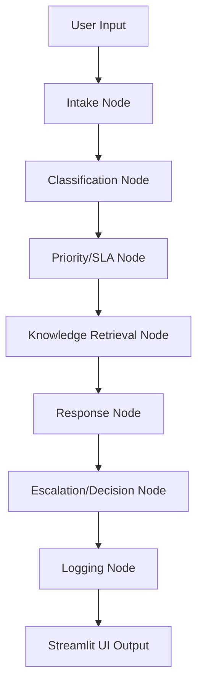

# 🎫 Smart Ticketing System 🚀

An intelligent, LLM-powered support ticket automation system designed to streamline customer support workflows using local AI.

---

## 📺 Project Walkthrough
[](https://youtu.be/lutghWHSEh4)

---

## 📖 Use Case
The **Smart Ticketing System** automates the lifecycle of a customer support ticket. Instead of manual sorting, it uses local Large Language Models (LLMs) to:
1.  **Analyze** the user's intent and urgency.
2.  **Categorize** tickets into departments (Technical, Billing, Account, etc.).
3.  **Retrieve** relevant help documents from a local knowledge base.
4.  **Draft** professional responses automatically.
5.  **Decide** whether the ticket is safe for an automated reply or requires a human agent's touch based on confidence scores and customer tiers.

---

## 🔄 Workflow
The system follows a linear pipeline managed by **LangGraph**:

1.  **Ticket Intake**: Normalizes user input (Subject, Description, Tier).
2.  **Intent Classification**: LLM identifies the category and calculates a confidence score.
3.  **Priority/SLA Mapping**: Assigns urgency (P0-P3) and response time goals.
4.  **Knowledge Retrieval**: Performs a keyword search in the local database to find relevant solutions.
5.  **Response Generation**: LLM drafts a context-aware reply using the retrieved knowledge.
6.  **Escalation Logic**: A decision engine routes the ticket to `AUTO_REPLY` or `HUMAN_REVIEW`.
7.  **Logging**: Every transaction is stored in a JSON-based log file for auditing.

---

## 📊 Flow Chart


---

## 📂 File Structure & Responsibilities

| File / Folder | Responsibility |
| :--- | :--- |
| **`app.py`** | The **Streamlit UI**; handles user inputs and displays AI decisions. |
| **`graph.py`** | The **State Controller**; defines the LangGraph workflow and state transitions. |
| **`agents/intake.py`** | Cleans and prepares ticket data for processing. |
| **`agents/classifier.py`** | **Intent Agent**; uses LLM to categorize and score the ticket. |
| **`agents/priority.py`** | **Business Logic**; maps categories to SLA and Priority levels. |
| **`agents/knowledge.py`** | **RAG Lite**; retrieves local context from `data/knowledge_base.txt`. |
| **`agents/response.py`** | **Drafting Agent**; uses LLM to write the final support response. |
| **`agents/escalation.py`** | **Safety Guard**; determines if the ticket needs human intervention. |
| **`utils/logger.py`** | **Auditing**; writes processing history to `logs/tickets.log`. |
| **`requirements.txt`**| Project dependencies. |
| **`Dockerfile`** | Containerization configuration for easy deployment. |

---

## 🧠 Model & Configurations

### Model Used
- **Model**: `llama3.2:3b`
- **Engine**: [Ollama](https://ollama.com)
- **Role**: The LLM handles **Zero-shot Classification** and **Contextual Text Generation**. Running locally ensures data privacy and zero API costs.

### Configurations
Create a `.env` file in the root directory:
```env
# Ollama configuration
# If running locally: http://localhost:11434
# If running in Docker (Windows/Mac): http://host.docker.internal:11434
OLLAMA_BASE_URL=http://localhost:11434
```

---

## 🚀 Setup and Run

### 1️⃣ Install & Start Ollama
1.  Download Ollama from [ollama.com](https://ollama.com).
2.  Pull the required model:
    ```bash
    ollama pull llama3.2:3b
    ```

### 2️⃣ Clone & Install Dependencies
```bash
# Clone the repository
git clone <your-repo-url>
cd smart-ticketing-system

# Install dependencies
pip install -r requirements.txt
```

### 3️⃣ Run the Application
```bash
streamlit run app.py
```
The app will be available at `http://localhost:8501`.

### 🐳 Running with Docker
```bash
# Build the image
docker build -t smart-ticketing-system .

# Run the container
docker run -p 8501:8501 smart-ticketing-system
```
